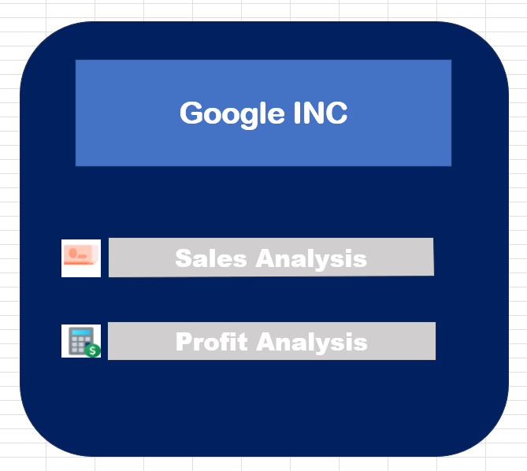
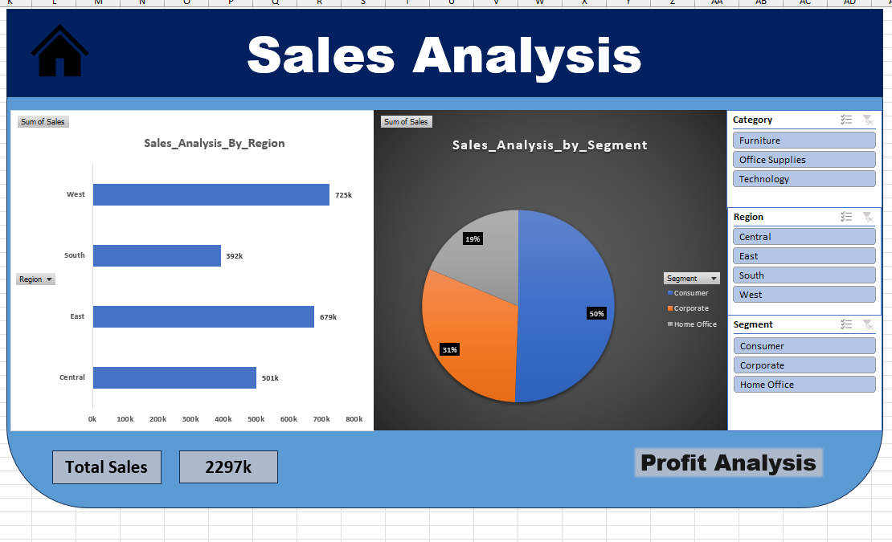
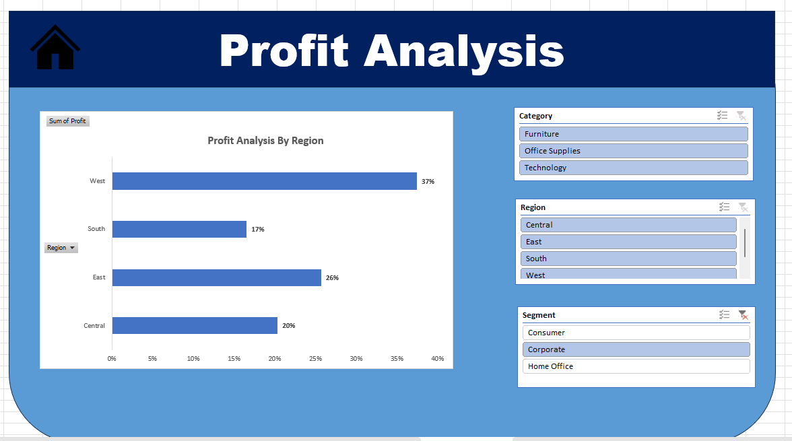

# Superstore Sales & Profit Dashboard (Excel)

## Project Overview

Developed an interactive Excel dashboard to analyze sales and profit performance across different regions, categories, and customer segments.

## Objective

Transform raw Superstore data into meaningful business insights using Excel dashboards and visualizations.

## Tools Used

- Microsoft Excel
- Pivot Tables
- Pivot Charts
- Slicers
- Dashboard Design

## Dashboard Preview

### Home Page

### Sales Analysis Dashboard

### Profit Analysis Dashboard

## Dashboard Features

- Sales Analysis Dashboard
- Profit Analysis Dashboard
- Interactive Slicers
- KPI Tracking
- Navigation Buttons
- Dynamic Charts

## Files Included

- Superstore_Dashboard.xlsx
- Project Requirements PDF
- Dashboard Screenshots

## Key Insights

- Regional sales performance comparison
- Category-wise sales analysis
- Segment-wise performance analysis
- Profit trend evaluation
